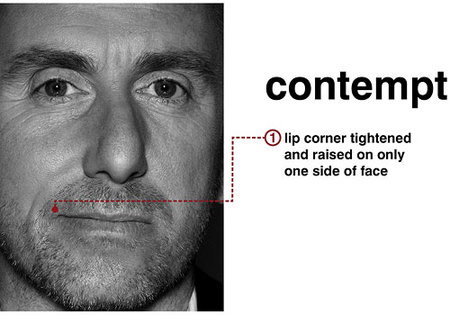

IT从业人员互相瞧不上太常见了,可以参见[程序员鄙视链][refer],但是慢慢地工作一两年,让我知道,其实这并没有什么卵用.

Be Kind
-----

HN 上的[推荐文章][hn], 引用最后几段,希望在以后的工作中,也能做到:

> Being kind isn’t the same as being nice. It isn’t about superficial praise. It doesn’t mean dulling your opinions. And it shouldn’t diminish the passion with which you present them.

与人为善并不是要你变得多么和善, 也不是让你阿谀奉承, 与人为善并不会让你放弃自己的原则, 放弃自己的追求和激情.

> Being kind is fundamentally about taking responsibility for your impact on the people around you. It requires you be mindful of their feelings and considerate of the way your presence affects them. 

与人为善要求我们至少对自己说的话负责,在乎对别人的影响, 它需要我们意识到别人的感受,意识到我们所做的事情必然会对其他人产生影响.

> Being kind hasn’t hurt my effectiveness at all. Being thoughtful about the emotions of my colleagues hasn’t made me any less right or wrong, it has simply made me more likely to be asked to help in the first place. Being invited to more conversations has allowed me to scale my impact in a way that would have been unfathomable on my own. 

与人为善根本不会伤害自己的积极性, 多考虑同事的感受也并不会让我们得到或者失去什么, 它仅仅让我变得更加合群和善, 同事也会喜欢请教我问题以及和我一起讨论问题.

[refer]: http://www.csdn.net/article/2014-12-15/2823139
[hn]: http://boz.com/articles/be-kind.html
