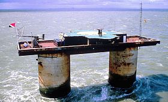

Bloody Yanks多数情况下是英国“绅士”对美国“乡巴佬”“土鳖”的蔑称。这篇博客源于今天在微博上偶得一图，亮点颇多，来好好扒扒哈！

没有找到作者和出处，甚是可惜，希望有人找到了发我。

槽点亮点如下：

1.&emsp;第一张图右边的站台有两个球，分别是爱沙尼亚和芬兰，站牌指向AnyWhere，估计是再说这两个北欧国家，人们生活都比较清闲随意，爱沙尼亚不知道，芬兰是啊，扫厕所的一个月都能拿1K欧，还没算各种社会福利。

2.&emsp;第一张图中间9站台和10站台明显有个闪电标志，《哈利波特》里面去魔法学校霍格华兹的9¾站台啊！

3.&emsp;第二张图火车上的poster，Sealand，[西兰公国][sealand]，一个在二战时建立的海上堡垒（怒涛塔），位于英国以东，德国以西。后几经波折，成为全球唯一一个私人建立，不被承认的国家，总领土面积就是那个废弃的堡垒塔（怒涛塔），总人口5。

######这就是怒涛塔（Roughs Tower），哎，真怒

4.&emsp;第二张图行李架上的哈萨克斯坦国旗，偷渡的？

5.&emsp;第二张图希腊球梦中求饶“ no germany...no ... " ，希腊政府一直负债累累，最近又要求德国赔款（二战的对其的伤害）。

6.&emsp;第二张图希腊球旁边的挪威球再看《石油财富月刊》，封面人物是阿拉伯联合酋长国球,但是挪威也产油么？不是冰鲜三文鱼很厉害么？

7.&emsp;第四张图，美国球拿着手机是汉堡牌的, Fat Fat Fat。

8.&emsp;第四张图，厕所出来个法国球，刚偷情完？

8.&emsp;第五张图，过去半个球，应该是墨西哥球，后面美国球有说，”Mexico DO without Chicken，Thats Hilarious！“

9.&emsp;第六，七，八，九张没啥。

10.&emsp;第十张图，能看见一个阿三在火车上。

11.&emsp;第十张图，ArseBuck，菊巴克咖啡。

12.&emsp;第十张图，菊巴克墙上写的[《KONY 2012》][kony2012]，wikipedia是个电影，没看过，没听过，low逼了。

13.&emsp;第十一张图， 爱尔兰流浪汉，波兰修马桶的，瑞典的小偷，瑞典都上新闻了，专门偷中国人。苦逼的第三世界。

14.&emsp;第第十二张图，亮点爆了！！！ 超大号女鞋，参考新闻《大脚问题日益困扰英国女性》，地图上把所有母语是英语的国家都标注成了英国的殖民地。

15.&emsp;第十三张图， Will Kate 不是皇妃么？最近生娃那个。

16.&emsp;第十四张图， 大力神杯已经很久以前的事情了，英国球独领风骚的老照片，被德国（宝马）搞走的mini，墙上的Magna Carta大宪章，还有Gin和Cricket的书，意思就是以前牛逼过呗。亮点是最下面的书，Oppression The Irish， 压制爱尔兰？苏格兰最近刚要独立了。。。

17.&emsp;最后一张图，Bloody Yanks！美国乡巴佬！

* * *

如有不符或者缺漏，请留言。

[sealand]:http://zh.wikipedia.org/wiki/%E8%A5%BF%E5%85%B0%E5%85%AC%E5%9B%BD
[kony2012]:http://en.wikipedia.org/wiki/Kony_2012
