这篇是我为公司 [FIT2CLOUD](http://fit2cloud.com) 写的一篇 Step by step 教程。距离[上次](http://chixq.com/kube-seriers-1-basic)把玩 Kubernetes 已经过去一年了，Kubernetes 一直保持着
高速演进的速度。当然，搭建 Kubernetes 已经不是什么新鲜的事情，通过这篇教程，我只是希望能帮助那些想要快速实验 Kubernetes 的朋友。
<span class="more"></span>

>目录:
>
>- [一、Kubernetes概述](#Kubernetes_overview)
>- [二、Kubernetes、青云QingCloud、FIT2CLOUD三者之间的关系](#FIT2CLOUD_and_Kubernetes)
>- [三、部署前的准备工作：青云QingCloud VPC配置](#prepare)
>- [四、使用FIT2CLOUD部署和管理Kubernetes集群](#FIT2CLOUD_deploy_Kubernetes)
>    - [4.1、创建Kubernetes集群](#Provision_Kubernetes)
>    - [4.2、监控Kubernetes集群](#Monitor_Kubernetes)
>    - [4.3、Kubernetes自动伸缩设置](#Scale_Kubernetes)
>- [五、总结](#summarize)

<h3 id="Kubernetes_overview">一、Kubernetes概述</h3>

Kubernetes是Google一直在推进的容器调度和管理系统，是Google内部使用的容器管理系统Borg的开源版本。它可以实现对Docker容器的部署，配置，伸缩和监控等。当下，Kubernetes绝对是最火热的开源工程之一，在短短的一年多时间里，其Github工程已有接近两万次的Commits提交，一千多个PR。目前已经正式发布1.0版本，具备服务生产环境的能力。

Kubernetes作为容器管理和调度系统，能在多台Host上部署预定义的容器，实现跨Host容器的互通访问。下图是Kubernetes的High-level架构图：

![Kubernetes基础架构图][kubernetes-key-concepts]

Kubernetes的基本概念包括：

* **Cluster**：Kubernetes维护一个集群，Docker的containers都运行其上。并且，这个集群可以运维在任何云及Bare Metal物理机上。
* **Master**：Master节点包含apiserver，controller-manager，sheduler等核心组件（常常也将etcd部署于其中）。
* **Node**：Kubernetes采用Master-Slaves方式部署，单独一台Slave机器称为一个Node（以前叫 Minion）。
* **Pods**：Kubernetes最小管理单位，用于控制创建、重启、伸缩一组功能相近，共享磁盘的Docker容器。虽然Pod可以单独创建使用，但是推荐通过Replication Controller管理。
* **Replication controllers(RC)**：管理其下控制的Pods的生命周期，保证指定数量（replicas）的Pods正常运行。
* **Service**：可用作服务发现，类似于Loadbalancer，通过Selectors为一组Pods提供对外的接口。
* **Labels**：K/V键值对，用来标记Kubernetes组件的类别关系（例如标记一组Pods是frontServices，另一组是backServices）。Labels对于Kubernetes的伸缩调度非常重要。

如果想了解Low-Level的架构细节，可以查看其官网的架构图[http://kubernetes.io/v1.0/docs/design/architecture.png](http://kubernetes.io/v1.0/docs/design/architecture.png)。

从官网的架构图中可以看到，Kubernetes是一个组件多且依赖复杂的系统（上图仅仅是单Master，三台Node的情况。目前，Kubernetes已经支持Multi-Masters的部署架构，即需要至少三台主机作为Master）。并且Kubernetes社区开发速度非常快，版本差异大，文档更新往往不及时。所以，如果需要完整部署测试仍然有不少的工作量。如果要在生产中使用它，其运维管理也有较高的门槛。这里，我们将详细介绍如何使用FIT2CLOUD帮助用户高效完成Kubernetes的系统部署、日常运维等，降低用户使用它的难度。

<h3 id="FIT2CLOUD_and_Kubernetes">二、Kubernetes、青云QingCloud、FIT2CLOUD三者之间的关系</h3>

首先，Kubernetes作为容器管理系统，其自身也需要部署在相应的计算资源之上。而我们认为只有部署在IaaS平台上的Kubernetes才能充分发挥其弹性调度管理的特性。这里，我们选择了QingCloud作为部署Kubernetes集群的IaaS平台，主要是考虑如下几个因素：

1. 从安全角度看，类似Kubernetes这类的PaaS应该是部署在VPC内。青云VPC在国内是独树一帜，特别适合用来部署Kubernetes这种分布式应用。
2. 从部署管理角度看，青云提供的“userdata”和“metadata”功能在自动初始化云主机上非常有用，可以简化整个部署过程。
3. 从成本和灵活性角度看，青云的按秒计费，资源快速响应是非常有吸引力的。这点以我们自身为例：一年多以来我们已经在青云上面创建了超过1万五千台虚机，花费仅在1000多。

其次，Kubernetes本身作为一个复杂的分布式应用，也需要工具（比如FIT2CLOUD）来实现快速部署、统一管理、监控告警、升级和伸缩。Kubernetes负责容器的调度和管理，FIT2CLOUD则负责主机的调度和管理。

最后，从目标用户视角看，Kubernetes集群(容器云)的使用者是应用开发人员，或者准确的讲是基于Docker容器的微服务开发者，而FIT2CLOUD和QingCloud的使用者是Kubernetes集群（容器云）运维和系统管理员。下图清晰描述了Kubernetes、QingCloud、FIT2CLOUD三者及其使用者之间的关系：

![FIT2CLOUD、K8S、QingCloud][fit2cloud_vs_k8s]

<h3 id="prepare">三、部署前的准备工作：青云QingCloud VPC配置</h3>

QingCloud的VPC基于二层网络隔离，实现了100%的私有网络隔离，并且用户在其Web控制台就能完全操作VPC私有网络，包括创建私有网络，绑定公网 IP，DHCP，端口映射转发等。

我们推荐在QingCloud的VPC内网中部署Kubernetes，之后通过绑定公网IP和端口映射将KubernetesMaster节点的apiserver endpoint暴露出来。具体部署架构如下图所示：

![青云 VPC][qingcloud_vpc_overview]

在此之前，我们需要在QingCloud的Web控制台上配置下VPC网络。具体如下：

**1、**创建一个VPC私有网络，同时创建一个路由器，如下图所示：

![][qingcloud_vpc_create_subnet]

**2、**创建一个虚拟路由器，并把上一步创建的私有网络连接到该路由器上，如下图所示：

![][qingcloud_vpc_create_router]

    注意：创建虚拟路由器时，需打开该虚拟路由器所用防火墙下行8080端口。因为该端口将在后面用于向外暴露Kubernetes服务接口。

**3、**申请一个公网 IP，绑定在路由器上，以便VPC内的Kubernetes apiserver 可以通过路由器对外提供服务。

![][qingcloud_vpc_public_ip]

**4、**在VPC内建立一个负载均衡器（LoadBalancer），并为其在8080端口负载均衡器的监听器来监听Kubernetes Master节点上的apiserver服务（该服务默认运行在8080端口）。**这样做的好处是可以只需要配置一次VPC私有网络及端口转发规则，在私有网络内部启动关闭主机都会自动attach到LoadBalancer，对外提供服务。**具体操作如下图：

![][qingcloud_vpc_listener]

一旦VPC创建配置完成，就可以开始通过FIT2CLOUD快速部署Kubernetes集群。

<h3 id="FIT2CLOUD_deploy_Kubernetes">四、使用FIT2CLOUD部署和管理Kubernetes集群</h3>

<h4 id="Provision_Kubernetes">4.1、创建Kubernetes集群</h4>

如上所示，本次示例中，我们会部署一个单Master(192.168.0.3)，2个Nodes（Minions）节点的Kubernetes集群。首先，我们会在FIT2CLOUD上创建两个不同的虚机组。一个是k8s-master，作为Master节点；一个是k8s-node作为Nodes 节点。具体步骤如下所示：

_注：通过FIT2CLOUD在QingCloud上启动机器，需要先登入FIT2CLOUD控制台并绑定QingCloud云账号，具体步骤可以参考FIT2CLOUD[官方文档](http://docs.fit2cloud.com/v1.1/usersetting/cloud-account-setting.html)。另外请参考 [FIT2CLOUD新手指南（QingCloud版）](http://docs.fit2cloud.com/v1.1/getting-started/getting-started-with-qingcloud.html)了解如何快速开始在FIT2CLOUD中管理QingCloud资源。_

**第一步：通过FIT2CLOUD控制台创建Kubernetes集群和虚机组**

如下图创建Master节点虚机组。**注意这里必须按指定虚机组名称，因为后续的初始化Master节点脚本需要利用到这个参数自动发现master的相关信息。**

![][fit2cloud_create_role_popup]

类似创建Node节点的虚机组。两个虚机组创建完成后会在虚机组列表中显示，如下图：

![][fit2cloud_create_role]

**第二步：新建虚机创建模版，分别用来Provision Master节点主机和Nodes节点主机**

“虚机创建模板”是FIT2CLOUD内用来快速创建云主机的预定义模板。包括云账号信息、云主机配置以及相关初始化操作。为快速Provision这里的Kubernetes集群，我们需要首先新建这些模板。为新建这些模板并实现自动部署Kubernetes集群，我们已经在FIT2CLOUD中内置了3个Kubernetes集群部署脚本（这些脚本在CentOS 7.0系统上测试通过，在本示例中无论是Master节点还是Salve节点都请选择CentOS 7.0操作系统），分别如下：

- `k8s_master_installer.sh`：用来部署Kubernetes Master节点。
- `k8s_node_installer.sh`： 用来部署Kubernetes Node节点。
- `k8s_ui_installer.sh`：用来激活安装 kube-ui (Kubernetes webUI)。

这些脚本可以在FIT2CLOUD的脚本列表中查看到，如下图：
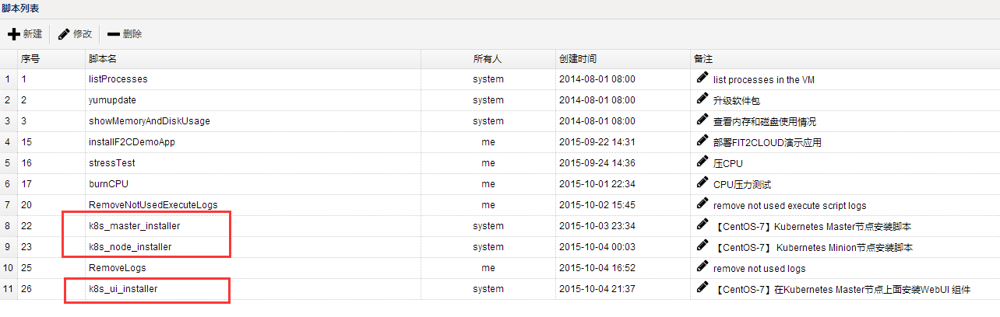

首先，设置Master节点的“创建虚机模版”，如下图：

![][create_k8s_master_template_script]

在这其中有两个点需要注意，具体如下：

- 第一点：如上图可见，创建虚机模版时可以在初始化操作中执行脚本，这里选择Kubernetes Master节点的安装部署脚本`k8s_master_installer.sh`。如希望了解Master节点的部署流程，请仓库该脚本内具体内容。
- 第二点：需要在Master节点的“创建虚机模板”内指定Master主机自动attach到负载均衡器上，从而将Kubernetes Master节点上的apiserver暴露给VPC外部，方便用户从VPC外部通过公网IP控制Kubernetes集群。同时，集群上运行的真正负载Service也可以由此通过apiserver proxy供外部访问。该设置如下图所示：

![][create_k8s_template_network]

其次，设置Node节点的“创建虚机模板”。和Master节点类似，设置Node节点的“创建虚机模板”时候需要指定初始化脚本为`k8s_node_installer.sh`，并同样把启动的Node节点放到和Master节点相同的QingCloud私有网络。但是，Node节点不需要如同Master节点那样挂载到负载均衡器上（因为Node节点在本示例不需要对外暴露端口，而是通过Master节点的apiserver proxy转发的方式对外暴露服务）。`k8s_node_installer.sh`脚本中详细描述了整个Node节点的部署流程，如下图：

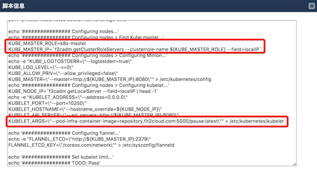

在Slave节点的部署脚本中需要注意如下两点：

1、 上图第一处红色标注中，脚本会调用`f2cadm`命令获取集群Master节点的内网IP信息，以便配置Node节点的kubelet服务，使其加入集群。 其中，`f2cadm`是FIT2CLOUD提供的命令行工具，可在任何被FIT2CLOUD管理的机器上运行。该命令行工具可从FIT2CLOUD服务端获取当前集群／虚机组／虚机的元数据信息。这里，`f2cadm`工具通过虚机组名称"k8s-master"来获取集群中Master节点的内网IP信息，这也是为什么前面创建Master节点虚机组名称必须为"k8s-master"的原因。当然，理论上只需要保持脚本内和虚机组定名称一致即可，不一定必须是"k8s-master"。
  
2、 kubelet配置文件中，设定 `KUBELET_ARGS=\"--pod-infra-container-image=repository.fit2cloud.com:5000/pause:latest\"`。如果不设置，国内用户启动 kubelet 服务会到Google服务器下载 pause 的image，这会导致网络问题。

**第三步：创建Kubernetes集群所需的虚机**

完成上述配置之后，我们就可以回到控制台虚机页面，按顺序启动一台KubernetesMaster 主机，等待其创建成功并执行初始化部署脚本完毕，再启动2台Nodes主机（以后如果需要扩展Node节点，只需要再启动所需数量的Nodes主机即可）。如下图，Kubernetes集群已经创建完毕：

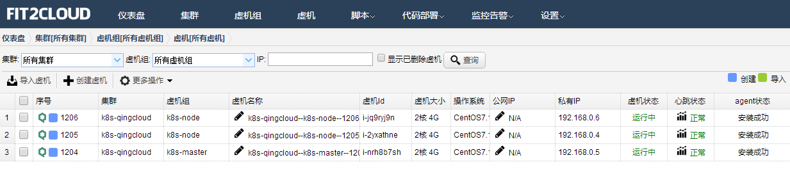

至此，Kubernetes集群启动完毕，并已经可以部署完成并正常工作。这里尝试用`kubectl`命令行工具检查下集群状态。在本地运行该命令后，其结果会展示2个Node节点已经上线（Ready），具体如下。

```
➜  ~ export KUBERNETES_MASTER=http://119.254.111.36:8080
➜  ~ kubectl get nodes
NAME            LABELS                                 STATUS
192.168.100.3   kubernetes.io/hostname=192.168.100.3   Ready
192.168.100.5   kubernetes.io/hostname=192.168.100.5   Ready
```

由于是本地使用 `kubectl` 命令，需要设定下 KUBERNETES_MASTER 环境变量（apiserver endpoint地址），即为VPC出口公网IP的8080端口。

这时候我们就可以开始测试一些Kubernetes的基本功能，比如创建Replication Controllers，启动nginx pods 并注册一个名为nginxservice的Service做服务发现。

创建 replication controller

```
➜  k8s cat ./nginx-rc.yaml
apiVersion: v1
kind: ReplicationController
metadata:
  name: nginx
spec:
  replicas: 3
  selector:
    app: nginx
  template:
    metadata:
      name: nginx
      labels:
        app: nginx
    spec:
      containers:
      - name: nginx
        image: index.alauda.cn/library/nginx:latest
        ports:
        - containerPort: 80
➜  k8s kubectl create -f nginx-rc.yaml
replicationcontrollers/nginx
```

检查 pods 启动状态：

```
➜  k8s kubectl get pods
NAME             READY     REASON    RESTARTS   AGE
nginx-5wjo3      1/1       Running   0          14m
nginx-a2nak      1/1       Running   0          14m
nginx-lb5rv      1/1       Running   0          14m
```

注册名为nginxservice的Service：

```
➜  k8s cat nginx-svc.yaml
apiVersion: v1
kind: Service
metadata:
  labels:
    name: nginxservice
  name: nginxservice
spec:
  ports:
    - port: 80
  selector:
    app: nginx
➜  k8s kubectl create -f nginx-svc.yaml
services/nginxservice
```

创建好nginx pods和相应service后，我们可以通过apiserver proxy转发集群内部的service， 这样我们就可以通过 Master节点8080端口访问集群Node节点上运行的nginx服务。

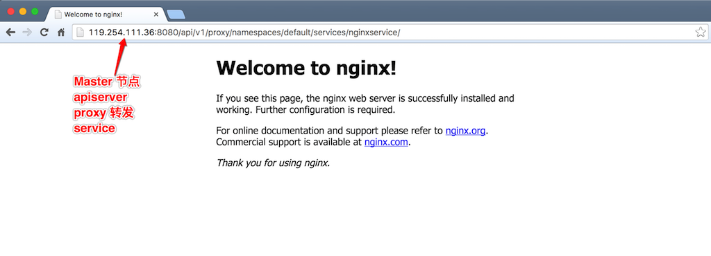

> 本示例为简单起见，选择了apiserver proxy来转发集群内Node节点的服务。用户还可以设置其他方式访问Node节点上的服务。更多具体的Kubernetes的操作细节，可以参考 Kubernetes [官方文档](https://github.com/kubernetes/kubernetes/tree/master/docs)。


**第四步：安装Kubnetes WebUI**

此外，FIT2CLOUD还内置了Kubernetes webUI addon的安装脚本，只需要在Master节点上执行一下 `kube_ui_installer.sh`脚本就可以激活安装 kube-ui。

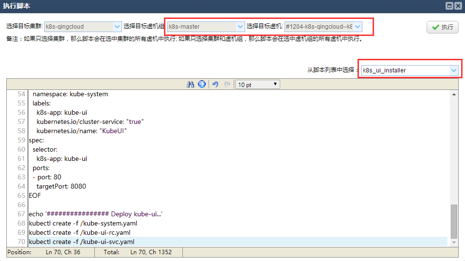

等待脚本执行完毕，访问VPC路由器上绑定的公网IP(端口为8080），即http://<公网_IP>:8080/ui，就能看到部署成功的Kubernetes WebUI。其上会展示该集群的基本信息、当前状态等。

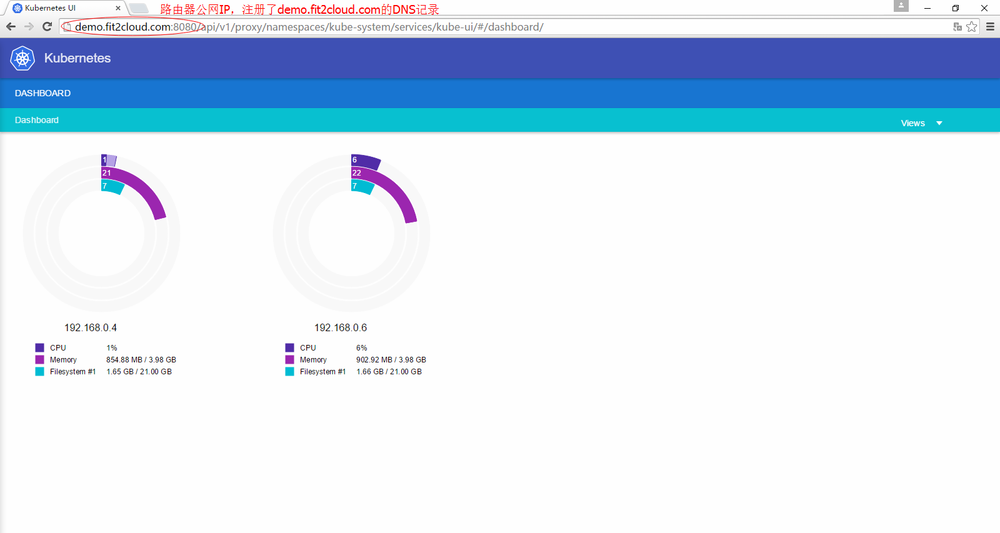

<h4 id="Monitor_Kubernetes">4.2、Kubernetes集群监控</h4>

与前文所述，**Kubernetes负责的是容器的创建、部署、监控和伸缩，FIT2CLOUD负责的是VM（虚机／云主机）的创建，部署，监控和伸缩**。FIT2CLOUD默认系统监控可以对Kubernetes集群的CPU、内存、硬盘和网络进行监控，也可以设定`自定义监控指标，对Docker或者Containers做应用级别的监控。例如，可以监控每台KubernetesNode上的containers数量，方便以后基于Nodes节点的Containers数量来伸缩Nodes虚机。如下图尝试设置该自定义监控。

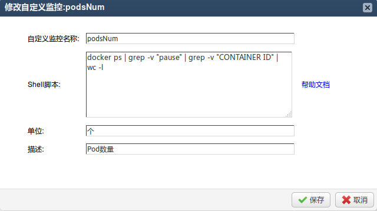

将其应用于Kubernetes Node虚机组（包括两台机器）上：

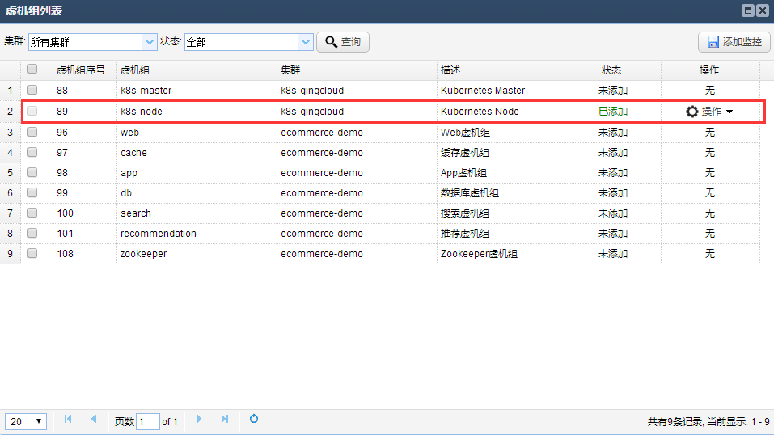

Kubernetes集群的Node节点已经应用了一个自定义监控指标，现在可以尝试启动50个nginx的容器，在Master节点执行如下命令

    kubectl run my-nginx --image=nginx --replicas=50 --port=80

等待几分钟后就可以在监控面板上实时查看Kubernetes集群中每个Node上的container数量（如下图所示）：

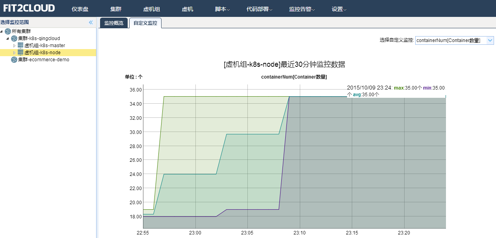

除此之外，也可以在通过这个自定义监控实现VM水平上的自动伸缩，下面马上会介绍如何利用FIT2CLOUD自定义监控实现Kubernetes集群的自动伸缩。

<h4 id="Scale_Kubernetes">4.3、Kubernetes集群自动伸缩设置</h4>

我们知道，`kubectl scale` 命令可以用来伸缩容器数量，实现容器(应用)水平的伸缩，但是对于虚机水平的伸缩，Kubernetes自身无能为力，这就需要类似FIT2CLOUD这样的管理平台来帮忙实现。**FIT2CLOUD所做的虚机水平自动伸缩，能保证Kubernetes集群中容器（应用）水平的伸缩能够不受限于节点数量和每个节点的配额限制，保证容器（应用）的成功伸缩。**

这里假设Kubernetes Nodes中的Pods/Containers的资源配额是40个，通过FIT2CLOUD设定自定义监控指标监控Nodes中的Containers数量。当超过80%资源配额（40*80%＝32个）后，自动创建一台新的Kubernetes Nodes云主机，并自动部署后加入到集群之中；同理也可以设定当每台Nodes中的Pods/Containers平均数量小于一定数值时，自动回收云主机，节约开支。通过如此设置就能够保证当Kubernetes集群的负载达到资源配额上限前提前通过FIT2CLOUD扩容云主机并加入集群，保证上层容器扩容得以顺利实施。当突发负载发生并触发Node节点的资源配额上限时，同样会触发FIT2CLOUD自动伸缩机制并扩容云主机加入集群，然后由Kubernetes调度机制保证新加入云主机最终承担相应的负载。下面示例将演示突发负载这一场景。

现在假定已经通过上述教程创建好了一个单Master节点，3个Node节点的Kubernetes集群。接下来演示如何利用FIT2CLOUD自动伸缩功能支持上层Kubernetes的弹性伸缩特性。

**1、**首先，在虚拟机组页面，对Kubernetes Node节点，设定自动伸缩。

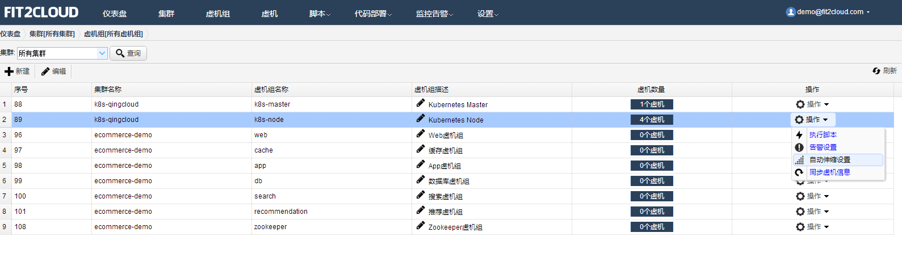

采用情景伸缩，针对我们上面所述自定义监控指标，当Node节点上的平均pod数量超过32个时扩容一台Node云主机；当其中Node节点上的平台pod数量最小值小于20台时，缩容一台Node云主机，由Kubernetes自行将这一台上已有的pod在其他Node上重新启动。具体设置如下：

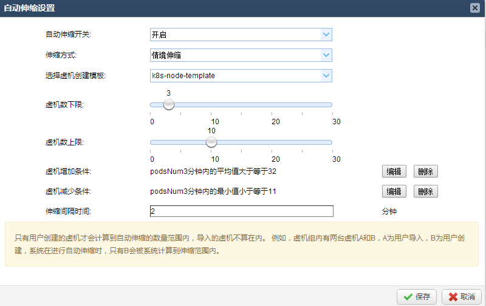

**2、**其次，当自动伸缩设置完毕之后尝试通过kubectl工具，把nginx pod总数扩展到150台。

    kubectl scale rc my-nginx --replicas=150

观察自动伸缩情况，现在总共有3台Node。当pod总数突然扩展到150台时，由于Kubernetes的默认配额限制（每个节点pod数量不得超过40），现在每台Node上最多运行40个pods，总共3*40=120个，无法满足Kubernetes层扩容到150台的要求，如图：

_当前总共有3台Node_
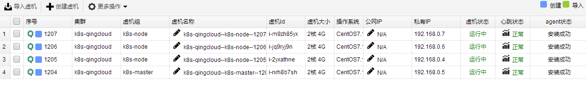

_自定义监控每台Node上实际的pod数量_
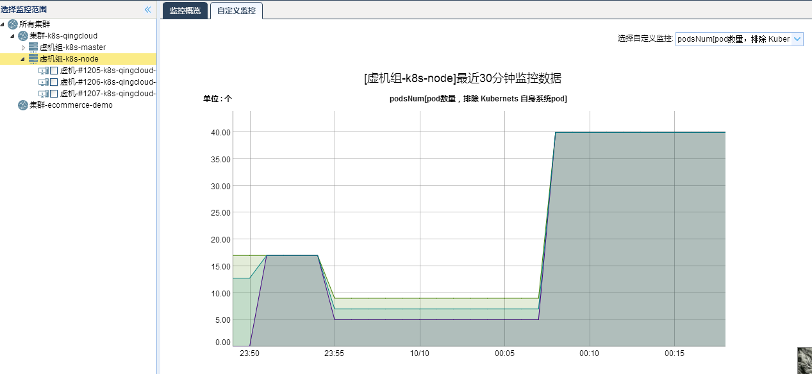

但是，这时平均每台Node上会运行40个pod，这会触发40>32个pods的自动伸缩条件，FIT2CLOUD自动伸缩机制会扩容一台Node主机，如图所示：

_系统已经扩展了一台Node，新扩展的节点通过虚机模板创建启动，自动会加入Kubernetes集群_
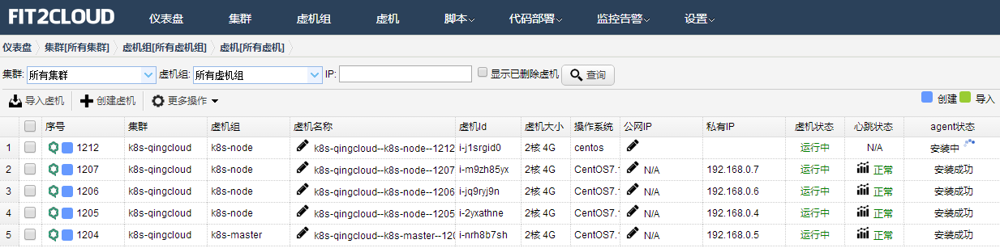

新启动的Node节点加入Kubernetes集群后，Kubernetes会自动把前面未成功scale的30个containers调度到该台Node节点运行。在FIT2CLOUD中查看之前创建的自定义监控指标“podsNum”即可观察到这一点。

<h3 id="summarize">五、总结</h3>

Kubernetes代表着目前最先进的容器管理系统，但是它作为PaaS(容器云)与IaaS（或者Bare-Metal物理机）之间还需要FIT2CLOUD对其进行运维管理。FIT2CLOUD可以帮助类似Kubernetes这样的PaaS(容器云)更好在云环境中使用。Kubernetes＋FITCLOUD＋QingCloud可以让用户非常快速稳定地从底至顶搭建一套容器管理系统。

[kubernetes-key-concepts]:kubernetes-key-concepts.png
[qingcloud_vpc_overview]:qingcloud_vpc_overview.png
[qingcloud_vpc_create_subnet]:qingcloud_vpc_create_subnet.png
[qingcloud_vpc_public_ip]:qingcloud_vpc_public_ip.png
[qingcloud_vpc_create_router]:qingcloud_vpc_create_router.png
[qingcloud_vpc_listener]:qingcloud_vpc_listener.png
[k8s_deploy]:k8s_deploy.png
[fit2cloud_create_role_popup]:fit2cloud_create_role_popup.png
[fit2cloud_create_role]:fit2cloud_create_role.png
[create_k8s_master_template_script]:create_k8s_master_template_script.png
[create_k8s_template_network]:create_k8s_template_network.png
[fit2cloud_vs_k8s]:fit2cloud_vs_k8s.png
