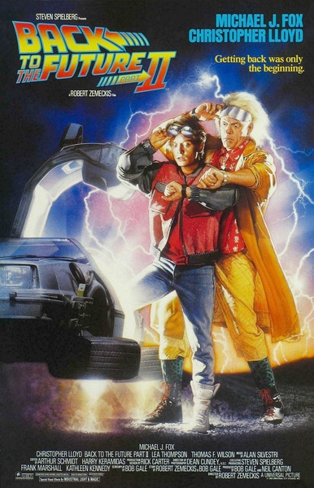
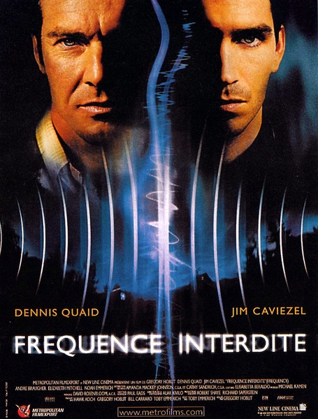
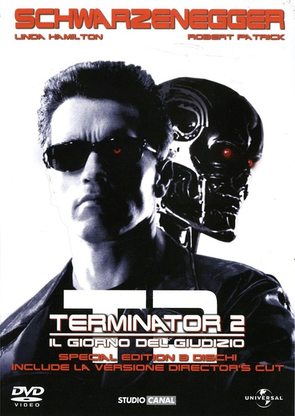
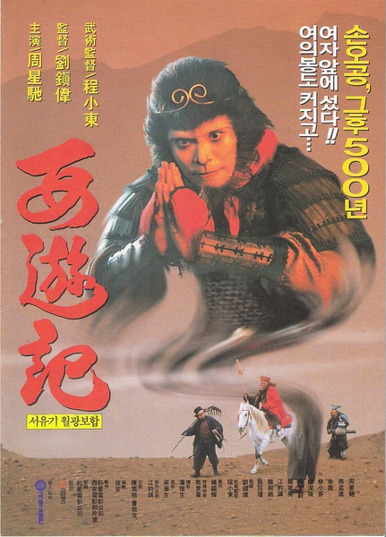
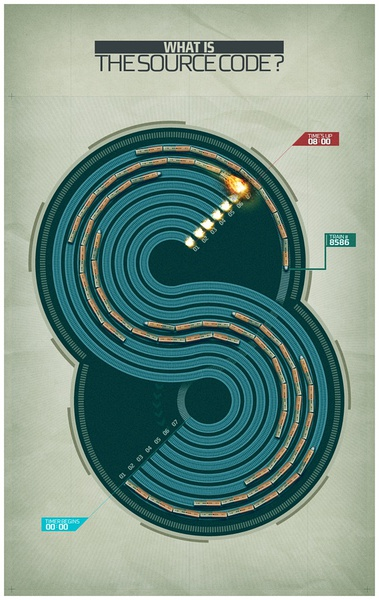

电影，要么在表达导演的诉求，要么在表达观众的诉求。对于科幻电影，这是在表达人类的诉求。科幻电影中，尤其以时间旅行类的电影（当然还是电视剧不是？）最为吸引观众，代替观众完成一些（目前）不可能实现的高难度动作（类比AV），票房高卖，成为大家热议话题。

上面这张壁纸是著名电影《Back to the Future》简单粗暴图解，看过这个系列电影的人应该要会心一笑。

### TL;DR
&emsp;&emsp;这篇总结的博文源于我女朋友很喜欢时间旅行类的电影，经常拉着我看，所以，趁着女朋友要过生日，赶制一篇，让媳妇高兴下。

* * *

### Why

&emsp;&emsp;上初中的时候，有篇课文讲过一个科幻故事。如果在里地球一光年的星球上安装一大面镜子，假设我们在地球上可以通过“望远镜”观察到这个镜子，那镜子里面是什么？应该是两年前的自己，因为光线从地球到一光年外的星球在折射回地球需要经历两年。

&emsp;&emsp;当时我幼小的心灵受到了极大的创伤，万一看过去看到两年前的自己不是自己怎么办！或者现在的我和两年前的我对视这种诡异的事情！于是乎，我喜欢看科幻电影了，像开篇所说，是一种诉求。

&emsp;&emsp;先说电影分类，评价好坏就有三个标杆，以奥斯卡代表的学院派，以烂番茄代表的影评人和以观众口味代表的IMDB，当然国内豆瓣影评抽水后也是一个重要标杆。这里，不想再做类似好坏评价推荐，只是瞄准一个类型的电影进行分类整理。

&emsp;&emsp;有语曰：

> * 做好细分市场，通过影响一部分能影响大部分人的人，来影响大部分人。 —— Kris.Chi

&emsp;&emsp;所以，能看到我这篇博文的人，你们就是那些能影响大多数人的winner啊!

### Start From Here

&emsp;&emsp;以IMDB官方数据，从1880年到2021年，总共产出2,868,874部影视作品，其中包含电视剧，短片和一些游戏视频等，其中In threater 或者 发出DVD的所谓正版电影，共计
307,710部。于此同时，IMDB对于科幻片（Sci-Fi）给出的数据，是76,178部，占了电影总量的将近1/4啊，超过成人65,358部 和战争20,402部，这很很让人欣慰啊，至少证明人们对于是保护地球，回到未来对抗外星人什么的热情还是高于炸翻地铁，X翻地球的冲动。

&emsp;&emsp;言归正传，此次整理是针对科幻片中时间旅行类，我在媳妇的带动下，看了些时间旅行类的电影，总结出来，时间旅行类的电影大致可以分为3类。
- 穿梭时空能改变现在和将来的。单一宇宙正向发展。
- 穿梭时空不能改变现在和将来的。
 - 平行宇宙。改变过去，会出现一个被改变的世界和一个未被改变的世界。
 - 宿命宇宙。改变过去，该来的还是会来。所谓诺维科夫自洽性原则。

#### 穿梭时空能改变现在和将来

&emsp;&emsp;这类电影最为意淫，回到过去修正错误，挽救自己甚至挽救全人类。

1.《回到未来》三部曲，最高分是第一部，8.5分。算是此类时间旅行电影的经典制作。现在看来，似乎是一个博士和他的小基友（高中生）的激情穿越故事。有意思的是第三集，上映于90年，博士失恋了，说到“She is one of a million, one of a billion, **one of a googleplex**. She is my dream, and I lost her for all time.”于是，Google成立于1998年。

2.《黑洞频率》7.3分。几乎是向《回到未来》致敬，儿子和父亲通过家里同一台长波电台跨越时空交流，并且互相“拯救”，温暖的亲情。

3.《环形使者》7.5分。一个通过非法时间旅行来帮助黑帮清理的人，被称作looper，为了不给黑帮留下麻烦，最终还要杀掉穿越过来的自己。

4.《终结者》系列最高分是第二部审判日8.1分。其中包括1，2，3还有最新的《终结者2018》以及一个电视剧《终结者外传》，很多人对于卡梅隆和阿诺的处女接触就是这部片子。反正我是记得我小时候跟着我爸妈分别原版英文，中文，还有当时镭射放映厅看了好几遍。

5.《大话西游之月光宝盒》7.9分。星爷经典，引用IMDB中的介绍：”the Monkey King is reincarnated as the Joker. He now spends his time chasing two jealous women. When one of them is dying, the Joker goes back in time in an attempt to save her. “ 哎。

#### 穿梭时空不能改变现在和将来之平行宇宙

1.《源代码》一次火车的事故中存活了一个人的......脑子，然后利用“高科技”让他的脑子回溯火车事故的前几分钟，试图拯救，后来发现，他只是拯救了那个世界的火车和......自己。

#### 穿越时空不能改变现在和未来之诺维科夫自洽