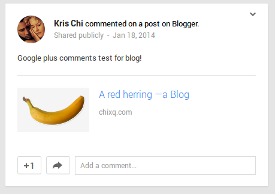
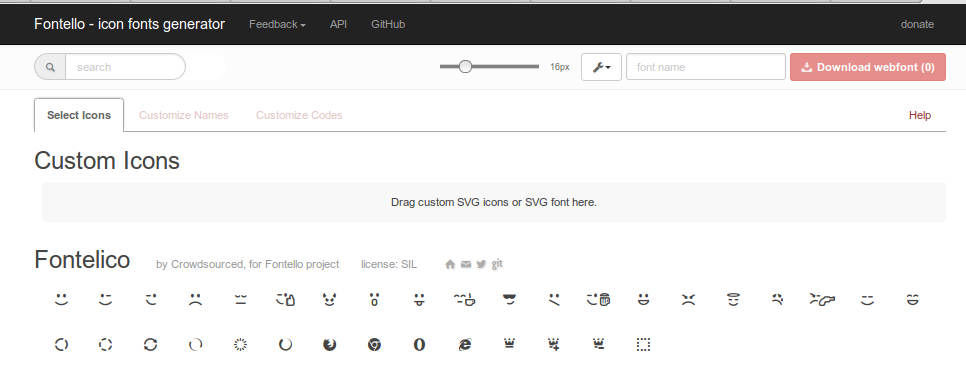

博客，是自媒体的一种形式，很大程度上反应了博主的三观。通过一个人的文字，和组织文字的方式，可以很方便的了解他和他的世界。
<span class="more"></span>


&emsp;&emsp;一波三折。和大多数从事IT行业的人一样，我爱折腾，单博客这块, 算的上数的就有当年的[博客中国][blogcn]，[Google App Engine][gap]的， 以及
前阵子折腾的[Ruhoh][ruhoh]和**aBlog**,折腾程度从最初的换换主题，到现在self-design-build-host。 现在的aBlog，虽然花费了不少功夫，但是从方方
面面，都是令我满意和欣慰的，在这篇文章里，我想我应该把这些美好的aBlog折腾记录下来。

* * *

### How I Met WinterSmith
&emsp;&emsp;创作是件开心的事情，寻找创作工具的过程也是充满欣喜。

&emsp;&emsp;大概在2010年的时候，我用vim，我遇到了vimwiki这个插件，参考了一位博主的[文章][vimwiki]，用vimwiki把wiki导出html，加上git repo建立了一个属于
自己的wiki站。但是，vimwiki 过多的自有命令和快捷键（太依赖 <Lead>)，加上当时对git很生疏，慢慢的就放弃了，总归是一次static website 的尝试。

&emsp;&emsp;后来，印象中没记错的话github pages 和 Jekyll 进入我的视野，没多久看到了阮一峰也开始写[入门][ruanyifeng]，static blog generator火了，国内外同时出现了各种不同语言
编写的博客框架，我当时找到一个ruby的博客框架————Ruhoh，做了些尝试。[浅尝辄止][ruhoh]。

&emsp;&emsp;自己都忘了是怎么遇到WinterSmith，不知道是twitter上哪位推友的推荐还是在Google node关键字的时候的偶遇，总之，一切来的奇妙，却不乏乐趣。
对于WinterSmith，个人开发，个人维护，引用官网的介绍就是

> * _“ Flexible, minimalistic, multi-platform static site generator built on top of node.js.”_

&emsp;&emsp;除了众多Static Blog Generator标配特性（markdown，template， permlink， coffee等）之外，让我选择WinterSmith的原因是他的**Easy Hack**，作者提供了plugin API
接口，可以很方便的开发，移植plugin。想要做一个好用的工具很容易，但是想要做一个让所有人都满意的工具，很难，WinterSmith像Firefox一样，提供了很大的扩展空间，这样
的想法实在很棒。除了官方打包中预置了一些plugin（jade, stylus, paginator),现在[github][plugins]上已经有很多wintersmith的plugin，其中推荐wintersmith-pandoc
插件，是对原生markdown的修补和提升。我现在也准备开发一下类似一键部署的插件，指日可待。对于WinterSmith的使用，结合[官网的介绍][intro]和标准的Static Blog Generator的
部署方式（毕竟生成的都是纯HTML），会十分方便。详细的教程google一下都有，翻译，复制，修改下没什么意义，完全是一种熵增的过程,但是我可以把我遇到的坑放在我自己的tips站（http://note.chixq.com),
以飨后来人。

```
    npm install -g wintersmith    // 通过npm下载wintersmith， npm就是node的包管理工具
    wintermith new blog_site_directory    // 方便的创建你的blog文档目录
```
```
    // 下面就是我当前站点的文档结构，非常清晰
    ├── build
    │   ├── 404.html
    │   ├── 500.html
    │   ├── archive.html
    │   ├── articles
    │   ├── asserts
    │   ├── CNAME
    │   ├── css
    │   ├── favicon.ico
    │   ├── feed.xml
    │   ├── font
    │   ├── google7a908d88826264ac.html
    │   └── index.html
    ├── config.json
    ├── contents
    │   ├── 404.json
    │   ├── 500.json
    │   ├── about.json
    │   ├── archive.json
    │   ├── articles
    │   ├── asserts
    │   ├── authors
    │   ├── css
    │   ├── favicon.ico
    │   ├── feed.json
    │   └── font
    ├── node_modules
    │   ├── coffee-script
    │   ├── connect-no-www
    │   ├── connect-powered-by
    │   ├── express
    │   ├── identify
    │   ├── moment
    │   ├── pandoc
    │   ├── pdc
    │   ├── typogr
    │   ├── underscore
    │   ├── wintersmith
    │   ├── wintersmith-pandoc
    │   └── wintersmith-stylus
    ├── package.json
    ├── plugins
    │   └── paginator.coffee
    └── templates
        ├── 404.jade
        ├── 500.jade
        ├── archive.jade
        ├── article.jade
        ├── author.jade
        ├── feed.jade
        ├── index.jade
        ├── layout.jade
        └── mixins.jade
```
```
    // 切到目录中， 可以直接
    wintersmith preview
    // 访问 127.1：8080 就能在本地看到demo站点了,这条命令支持热部署

    // 发布的时候，通过
    wintersmith build
    // 会自动生成 build/ 目录，里面存放的是你博客的所有raw html， 剩下的事情，
       放在github，dropbox或者自己的主机上，up to you.
```


### I Love Minimalism
&emsp;&emsp;Minimal风格是一种态度，简单的线条，突出功能，不需要太多的装饰，让人能感到平静并愿意沉浸其中，就是我所理解的极简。


&emsp;&emsp;我这个博客的名字（**aBlog**），本身就表达了一种极简的诉求(我想以后我的project都会prefix a)，在设计上，以demo的基础（wintersmith的demo本身也异常简约），参考了很多的我认为让我欣喜的网站的设计，并且取得了一些作者的许可，
尤其是IA.net，让我对于什么是最舒适的阅读体验有了更多的认识，aBlog的字体和排版同时遵循[**3:5 single-stranded Fibonacci scale**][fs]中描述的原则，同时背景采用了Git-SCM网站，乳白色的纸质感加上毫
不分散注意力的淡印，会让人有耐心享受阅读。

#### I'm not familiar with design, but I can choose
&emsp;&emsp;像上面说的一样，页面的想法很难付诸于设计中，很难表达出来。但是我可以参考一些最接近我想法的设计，想来这是一条捷径。以下列出了对于aBlog帮助很大
的网站，有些大站联系不上作者，感谢未至，深表歉意，当然，如果拙略“山寨”了一些设计让您不愉快，[请与我联系][email]。

* [IA.net Improving the Digital Reading Experience][improve]
* [IA.net Responsive Typography: The Basics][responsive]
* [single-stranded Fibonacci scale][fs]
* [Git-SCM][gitscm]
* [Wintersmith's Showcases][wsc]
* [Medium][medium]
* Many sites I cannot name them all here

#### Best practise of readability
&emsp;&emsp;对于可读性，囊括了很多方面，有优美的字体和排版，Responsively的网站设计，跨浏览器的一致性，从instapaper，悦读这样的软件，到代码级别的可读性都算readability(比如html，css
真的很反人类，幸好有jade，coffee这样的框架），我一直在探索，学习，偶有些收获，[以后也会将这些收获在aBlog中做一些尝试][updates]。或许，我可以在以后的博文中分享（翻译）
一些readability实践的好文章。

* * *

### Take Things Together
&emsp;&emsp;aBlog的建站过程中，有许多小坑，也有很多收获，大大小小的工具，插件组成了今天我们所看到的aBlog。
- Google+ comments Integration

Google+开放了评论组件，只要有Google账号，就能评论并且同步到自己的Google+，相比Disqus这些评论组件，Google能更好的抓取Google+的评论，相当于为自己的博客
免费做SEO，同时还不用多注册一个账号，挺好。
```
    // 在你的网站中引入googleplusone.js
    // 对于wintersmith 就是在layout.jade中添加
    <script src='https://apis.google.com/js/plusone.js' type='text/javascript'>
    // 之后在你需要评论的界面，添加组建就好
    // 对于wintersmith 就是在 article.jade中添加
     gapi.comments.render('gpluscomments',
                       {href: window.location.href, first_party_property: 'BLOGGER', view_type: 'FILTERED_POSTMOD'})
     gapi.commentcount.render('commentscounter', {
             href: window.location
         });
    // 上面第二条即是显示屏幕条数
```



Done!就是这么简单，可以在本页面下方测试评论

- Fontello



aBlog中的所有Icon Font都是使用这个在线api实现的，Icon Font的好处就是都是字体矢量图，渲染快且对于自适应的需求非常友好，Fontello有别于
其他很多Font API的是Choose only what you need，即避免了在线获取的慢，又避免了全都下到本地的大。

- Google Font API

基本上主流的浏览器都支持@web-font。aBlog的字体采用了如下配置，这里想说的是关于中文字体，尤其是免费中文字体，关注的人不多，可能是中文字体都过大，~~所以似乎也
没有像Google Font API这样的web font工具~~(UPDATE1)。

```
// fonts
$serif = 'Alegreya', georgia, serif, '微软雅黑'
$serif-alt = 'Alegreya SC', georgia, serif , '微软雅黑'
$sans = 'Open Sans', sans-serif, '微软雅黑'
$mono = menlo, consolas, monospace

// font-size
$font-size-large = 118% // ideal measure of ~64 characters
$font-size-small = 100%

// container sizes
$container-width-large = 680px
$container-width-small = 480px
```
```

// sizes based on 3:5 stranded scale
$sn3 = 0.4615
$sn2 = 0.6154
$sn1 = 0.6692
$s0 = 1.0
$s1 = 1.2308
$s2 = 1.6154
$s3 = 2.0
$s4 = 2.6154
$s5 = 3.2308
$s6 = 4.2308
$s7 = 5.2308
$s8 = 6.8462
$s9 = 8.4616

```
- Favicon

对设计不熟悉，但这个只能自己来，KC是我的英文名缩写（Kris Chi），在favicon.cc可以很方便的帮我生成一个简单的icon

- HighlightJS

wintersmith 自带的代码高亮看起来十分诡异，于是我替换成了HightJs，同时采用了solarized_dark主题，这个主题刚用感觉比较舒服，很精致，慢慢地会感觉一般，主要
是这个主题太火了以至于覆盖很全面，我喜欢一致性，现在我的vim，terminal，甚至IDE都统一用solarized_dark。

- Google Analytics + NameCheap

Google Analytics 很简单做统计用的，安装也很简单。我要说的是，现在很多国内的博客，网站，域名管理总喜欢用DNSpod，我以前也用，后来Google Analytic 总发邮件
说检测不到我的博客，后来才知道DNSPod分国内阉割版和国外版，且经常解析错误导致Google探测不到。于是换了NameCheap的[FreeDNS][freedns]，推荐。不仅没有管理域名的数量限制，还支持
Domain Forward，这个功能很重要，曾经GoDaddy的域名转发也是这么被墙的。
- ...


* * *

### Further Consideration
&emsp;&emsp;世界上总有很多不如意的地方，让我们苦恼烦躁，也正是由于这些不如意才让给了我们机会去改变这个世界。

&emsp;&emsp;**aBlog**有很多不完善的地方，比如设计思想基本是照搬，所以在中文字体的处理上不是很好。希望在以后能改进。

**UPDATE1**: _写完这篇文章之后Google了下，fonts.com已经支持[东亚字体][asiafont]，声称有[专利技术][patent]可以实现快速加载中文字体，同时，台湾一个网友建立的justfont.com也可以实现webfont,
有时间可以考虑采用下。_

[blogcn]:http://chilaoqi.blogcn.com
[gap]:http://buptlog.appspot.com
[ruhoh]:http://chilaoqi.ruhoh.com
[ia]:http://ia.net
[improve]:http://ia.net/blog/Improving-the-Digital-Reading-Experience
[responsive]:http://ia.net/blog/responsive-typography-the-basics
[fs]:http://lamb.cc/typograph
[gitscm]:http://git-scm.com
[wsc]:https://github.com/jnordberg/wintersmith/wiki/Showcase
[plugins]:https://github.com/jnordberg/wintersmith/wiki/Plugins
[intro]:https://github.com/jnordberg/wintersmith
[email]:mailto:chilaoqi@gmail.com
[freedns]:https://www.namecheap.com/domains/freedns.aspx‎
[ruanyifeng]:http://www.ruanyifeng.com/blog/2012/08/blogging_with_jekyll.html
[vimwiki]:http://wiki.ktmud.com/tips/vim/vimwiki-guide.html‎
[updates]:http://chixq.com/updates
[asiafont]:http://www.fonts.com/search/web-fonts?searchtext=chinese&SearchIn=web-fonts#product_top
[patent]:http://www.fonts.com/web-fonts/best-language-support
[medium]:http://www.medium.com